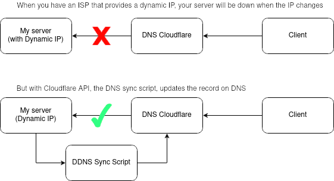

# Dynamic DNS Cloudflare (unofficial)

If you have a dynamic IP, this is a sync application for your DNS on Cloudflare.

## How to install

If you ware in linux don't download this repository, just do it:

1) `wget https://raw.githubusercontent.com/ayelsew/ddns-cloudflare/main/setup-linux.sh`  
2) `chmod +x setup-linux.sh`
3) `./setup-linux.sh`

By run this script it will help you to setup the app on your system

## How to use manually

--domain (required) - The domain base to detect zone ID
-d
  
--dns-record (required) - The domain DNS record to be update
-dr
  
--email (required) - Your email as administrator
-e
  
--auth-key (required) - Token of authentication with permision to edit DNS
-ak
  
--interval (optional) - Interval to check and update DNS record (see Interval pattern)
-i

Interval pattern
  s - seconds
  m - minutes
  h - hours
  d - day
  w - week
  
e.g: 2h for two hours or 4w four weeks  
e.g: ./ddns-cloudflare-linux -d examble.com -dr api.examble.com -e admin@example -ak j3y37t73dgghfasvkjldhaksd -i 30m

## OBS
This script was tested only in linux. Feel free to help improve this project.

## Setup to systemclt manually

1) Run `yarn run build` to generate file executable (ddns-cloudflare-linux) or download from [releases](https://github.com/ayelsew/ddns-cloudflare/releases/tag/1.0.0)
2) Edit param `ExecStart` and copy the file `ddns-cloudflare.service` to `/etc/systemd/system/`  
3) Run `sudo systemctl daemon-reload` to reload systemclt  
4) Run `sudo systemctl status ddns-cloudflare.service`
